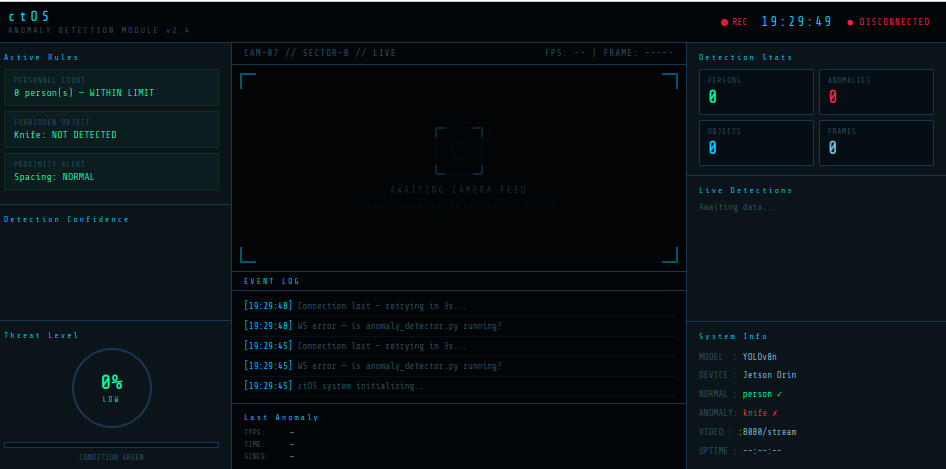
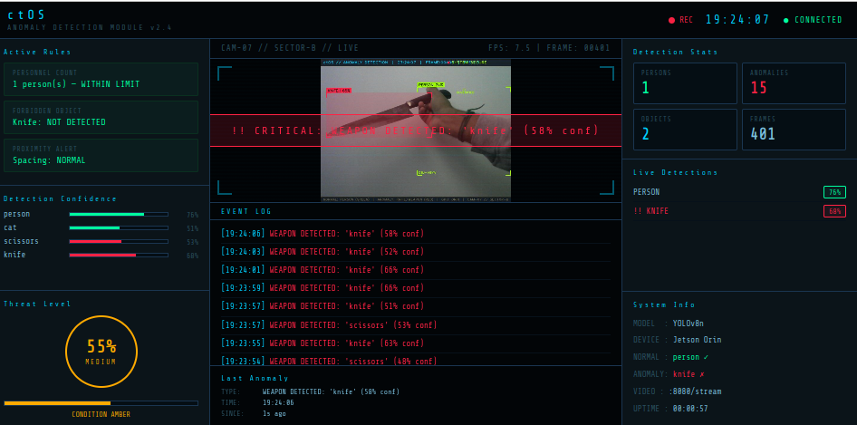

# ctOS — Watch Dogs Anomaly Detector
### *Watch Dogs–Themed Real-Time Anomaly Detection on NVIDIA Jetson Orin*

---

## Demo Screenshots

### System Idle — Awaiting Feed
<p align="center">
  
</p>

### Anomaly Detected — Knife CRITICAL Alert
<p align="center">
  
</p>

---

## About The Project

A **real-time anomaly detection system** running on **NVIDIA Jetson Orin (JetPack 6)** using **YOLOv8** object detection. The UI is inspired by **Watch Dogs' ctOS surveillance system** — featuring dark hacker aesthetics, cyan grid overlays, corner-tick bounding boxes, threat meters, and a live browser dashboard connected via WebSocket.

The system continuously analyzes a USB camera feed, applies rule-based anomaly logic, logs all events to CSV, saves annotated frames, and streams the live annotated video feed directly into the browser via MJPEG.

> **Person = Normal (Green box + ID:VERIFIED)**
>
> **Knife / Scissors = CRITICAL Anomaly (Red pulsing box + ALERT)**

---

## Features

| Feature | Description |
|---|---|
| **Knife / weapon detection** | CRITICAL alert when knife or scissors detected |
| **Person = normal** | Person is safe — green box with `ID:VERIFIED` badge |
| **Overcrowd detection** | Warning when >3 persons in frame simultaneously |
| **Proximity alert** | Warning when persons stand too close together |
| **MJPEG video stream** | Annotated camera feed streams directly into browser |
| **Watch Dogs HUD overlay** | ctOS-themed OpenCV overlay on live camera feed |
| **Browser dashboard** | Live WebSocket-connected Watch Dogs UI in browser |
| **Active rules panel** | Shows Personnel Count, Forbidden Object, Proximity status |
| **Detection confidence bars** | Live confidence bars per detected class |
| **Event log** | Timestamped log of every anomaly event in browser |
| **Last anomaly tracker** | Shows type, time, and seconds since last anomaly |
| **Threat level meter** | Dynamic threat circle — CONDITION GREEN / AMBER / RED |
| **CSV anomaly log** | Every event saved to `output/anomaly_log.csv` |
| **Auto frame capture** | Annotated frames auto-saved on every detection |
| **Cooldown debounce** | Prevents duplicate log entries (2s cooldown per rule) |

---

## Built With

- [Ultralytics YOLOv8](https://github.com/ultralytics/ultralytics) — YOLOv8n object detection
- Python 3.10 + asyncio + websockets + aiohttp + OpenCV
- NVIDIA Jetson Orin — JetPack 6 (R36.5)
- Conda environment `dev_38`
- Watch Dogs / ctOS aesthetic

---

## Getting Started

### Prerequisites

```bash
# Jetson Orin — JetPack 6 — inside dev_38 conda env
conda activate dev_38

pip install ultralytics --index-url https://pypi.org/simple/
pip install "numpy>=1.26,<2.0" --index-url https://pypi.org/simple/
pip install lap websockets aiohttp --index-url https://pypi.org/simple/
```

### Installation

```bash
git clone https://github.com/gopinathm188/ctOS-WatchDogs-Anomaly-Detector.git
cd ctOS-WatchDogs-Anomaly-Detector
```

### Running

**Step 1 — Start the backend on Jetson:**
```bash
conda activate dev_38
python3 anomaly_detector.py --camera 0
```

You will see:
```
[MJPEG] Video stream at http://localhost:8080/stream
[WS]   WebSocket on ws://0.0.0.0:8765
ctOS ANOMALY DETECTION — ONLINE
```

**Step 2 — Open the browser UI on Jetson:**
```bash
firefox watchdogs_ui.html
```

**Step 3 — Point USB camera at scene**
- Person in frame → **green box, ID:VERIFIED, no alert**
- Knife/Scissors in frame → **red pulsing box, CRITICAL ALERT, logged**

---

## How It Works

```
USB Camera
    ↓
anomaly_detector.py (YOLOv8 inference on Jetson GPU)
    ↓               ↓
MJPEG :8080     WebSocket :8765
    ↓               ↓
watchdogs_ui.html (Browser Dashboard)
  - Live video feed (MJPEG)
  - Detection stats
  - Event log
  - Threat level
  - Active rules
```

---

## Anomaly Rules

```python
RULES = {
    "forbidden_classes":  ["knife", "scissors", "baseball bat"],  # CRITICAL
    "max_persons":         3,        # Overcrowd warning
    "proximity_thresh":    0.25,     # 25% of frame width apart
    "min_confidence":      0.45,     # Ignore weak detections
    "cooldown_seconds":    2.0,      # Debounce between same-type logs
}
```

| Rule | Trigger | Severity |
|---|---|---|
| Forbidden object | Knife / scissors detected | CRITICAL 🔴 |
| Overcrowd | >3 persons in frame | WARNING 🟡 |
| Proximity | Persons too close | WARNING 🟡 |

---

## Results

| Detection | Confidence | Result |
|---|---|---|
| Person | 76% | ✅ Normal — green box |
| Knife | 58–66% | 🔴 CRITICAL — red alert |
| Scissors | 47–74% | 🔴 CRITICAL — red alert |

| Metric | Value |
|---|---|
| Model | YOLOv8n |
| Device | Jetson Orin GPU |
| FPS | ~7.5 FPS |
| Total anomalies (test run 1) | 15 |
| Total anomalies (test run 2) | 27 |
| Threat level during detection | MEDIUM (50–55%) |

---

## Output Files

```
output/
├── anomaly_log.csv         ← timestamped anomaly events
└── anomaly_images/         ← annotated frames on detection
```

**Sample `anomaly_log.csv`:**

| timestamp | frame | rule | severity | detail | objects_in_frame |
|---|---|---|---|---|---|
| 2026-04-22T19:24:06 | 008401 | forbidden_object | critical | WEAPON DETECTED: 'knife' (58% conf) | person, knife |
| 2026-04-22T19:28:11 | 082270 | forbidden_object | critical | WEAPON DETECTED: 'scissors' (74% conf) | scissors |
| 2026-04-22T19:27:57 | 082100 | forbidden_object | critical | WEAPON DETECTED: 'knife' (40% conf) | knife |

---

## Project Structure

```
ctOS-WatchDogs-Anomaly-Detector/
├── anomaly_detector.py     ← YOLOv8 + MJPEG + WebSocket backend
├── watchdogs_ui.html       ← Watch Dogs ctOS browser dashboard
├── output/
│   ├── anomaly_log.csv
│   └── anomaly_images/
├── docs/
│   ├── watchdogs_ui.png        ← idle/disconnected state
│   ├── Anomaly_detected_1.png  ← knife detection screenshot
│   └── Anomaly_detected_2.png  ← scissors detection screenshot
└── README.md
```

---

## Keyboard Shortcuts (OpenCV window)

| Key | Action |
|---|---|
| `Q` | Quit |
| `S` | Save screenshot manually |

---

## Improvement Suggestions

- Use **YOLOv8s** (small) for better accuracy at slight FPS cost
- Lower confidence threshold to **0.35** to catch partial/angled knife views
- Add **email/SMS alert** on CRITICAL detections
- Train a **custom knife dataset** for higher confidence scores
- Add **cooldown tuning** — currently 2s between same-type logs

---

## GitHub

- **Repository:** [github.com/gopinathm188/ctOS-WatchDogs-Anomaly-Detector](https://github.com/gopinathm188/ctOS-WatchDogs-Anomaly-Detector)
- **Author:** gopinathm188

---

## Acknowledgements

- [Ultralytics YOLOv8](https://github.com/ultralytics/ultralytics)
- [dusty-nv jetson-inference](https://github.com/dusty-nv/jetson-inference)
- [Best-README-Template](https://github.com/othneildrew/Best-README-Template)
- Watch Dogs / ctOS for the aesthetic inspiration

---

*"I can see everything." — Aiden Pearce*
